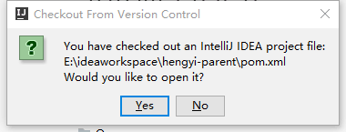
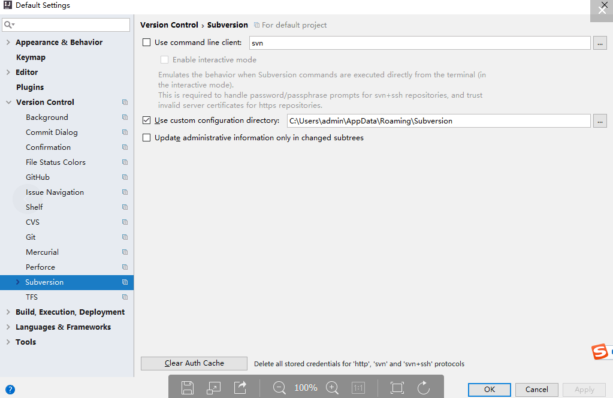
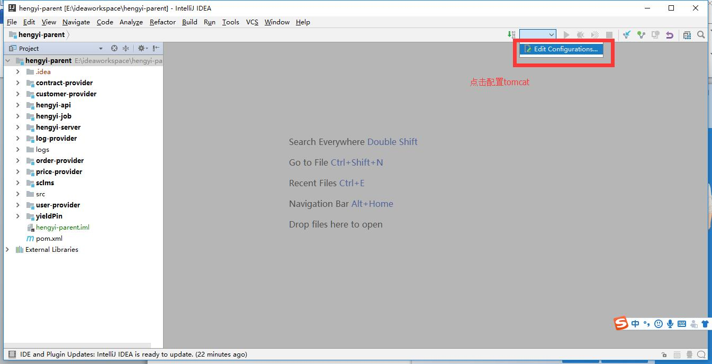

## **从SVN上导入后台工程** {#svn}

1.  破解完之后，打开IDEA，按如下界面填写key key可随意填写
2.  点击OK

1.  进入IDEA首页，选择setting，将本地SVN配置进IDEA

![C:\Users\admin\Documents\Tencent Files\385213918\Image\C2C\CD464(B(R`]12[NY(M6K]CF.jpg](../assets/cusersadmindocumentstencent_fi.jpeg)

1.  将本地SVN配置完成之后回到主界面，按下图点击选择SVN导入工程

![C:\Users\admin\Documents\Tencent Files\385213918\Image\C2C\@[M28IVP6{22P5U]K$K0~{F.jpg](../assets/cusersadmindocumentstencent_fi.jpeg)

1.  填写SVN 地址

1.  填写SVN账号密码

1.  选择SVN上的工程文件夹进行导入

![C:\Users\admin\Documents\Tencent Files\385213918\Image\C2C\_}B1U`7V{9[MZCI]W[L}4PF.png](../assets/cusersadmindocumentstencent_fi.png)

1.  选择本地储存的路径（工程会被导出复制到本地）

![C:\Users\admin\Documents\Tencent Files\385213918\Image\C2C\ZVPC3I$E9SB~21TY%5U2A]K.png](../assets/cusersadmindocumentstencent_fi.png)

1.  选择具体路径，点击OK

1.  出现提示框点击YES，读取POM.XML MAVEN配置文件

1.  等待工程导入（如未配置MAVEN镜像可能会耗时较长）

1.  工程导入完成，点击View-Tool Windows-Project 打开工程管理页面